# Kintsugi

## Description

Do you have stuff in your house that is broken but not quite junk? Maybe it’s a swivel chair that’s missing a wheel, a piece of electronics with wiring that needs to be soldered or a shirt with a rip in it. We're sure you do! Or, are you someone who has the skills to fix things, but not necessarily the cash to buy the best of the best?

Well, we have a place for you–Kintsugi! Our website incorporates the philosophy of Kintsugi the Japanese art of using gold to put pottery back together. With this in mind, we provide users with the option to buy and sell broken items that they may want to fix themselves and give a second life.

Kintsugi is a place where sellers of janky stuff meet with their discerning buyers. Delight in the secondhand splendors that are on offer, peruse the slightly tarnished wares, and revel in the world of “what could be” were just the right person to come upon it!

[~ Come Visit Us Today!](https://kintsugi-johnslist.herokuapp.com/)

**Tools & Skills Used**<br>
React, React Router DOM, Webpack, Heroku, MongoDB, Mongoose ODM, JWT, GraphQL, Node, Express, JavaScript, HTML, CSS, and Styled Components.

- [Installation](#installation)
- [Usage](#usage)
- [Credits](#credits)
- [License](#license)
- [Contributing](#contributing)
- [Links](#links)
- [Questions](#questions)

## User Story

```md
AS A user trying to sell or buy slightly broken items
I WANT an ecommerce platform
SO THAT I can buy and sell broken items
```

## Acceptance Criteria

```md
GIVEN an ecommerce platform
WHEN I load the homepage
THEN I am presented with a page containing a header, a section for content
WHEN I view the header
THEN I am presented with options for selling, buying, categories, and login
WHEN I click on the login page
THEN I am presented with a login page with inputs for email and password
WHEN I enter the email and password
THEN I am presented with the option to click the login button or sign up for a new account
WHEN I click on the sign up link
THEN I am presented with a sign up page with an email input, password input, and sign up button
WHEN I am logged in
THEN I am presented with the launch page for user or seller and a logout button is included in the navbar
WHEN I am logged in as the seller
THEN I am presented with my gallery of items I have on sale and the option to add an item to the gallery
WHEN I click on the button to add an item
THEN I am taken to the page for adding items with the full product details
WHEN I am on the product details page as a seller
THEN I have the ability to add an image, include a product description, include a price, and add it to the gallery
WHEN I click the button to add it to the gallery
THEN I am taken back to the gallery page
WHEN I am logged in as the buyer
THEN I am presented with gallery of possible products to buy
WHEN I click on an item then I am taken to the product details page for buyers
WHEN I am in the product details page as a buyer
THEN I am presented with an image of the product, product details, the item price, and add to cart button
WHEN I click on the add to cart button
THEN I am presented with a pop-up window thanking me for my purchase and a button to return to the gallery
WHEN I click on return to gallery
THEN I return to the product gallery page for buyers
WHEN I click on the logout button
THEN I am logged out
```

## Installation

This is a webpage, so no installation is necessary.

## Usage

Please see below for examples of this application's usage:

### Workflow

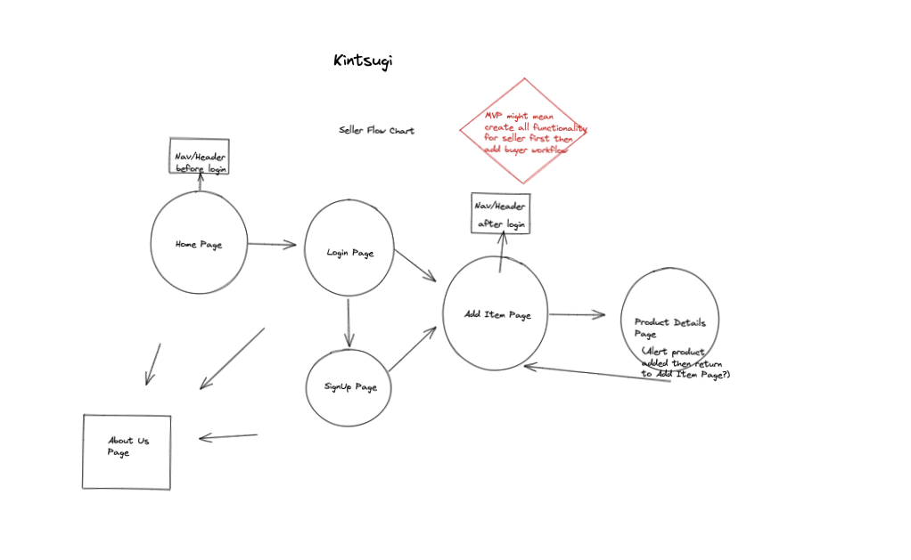

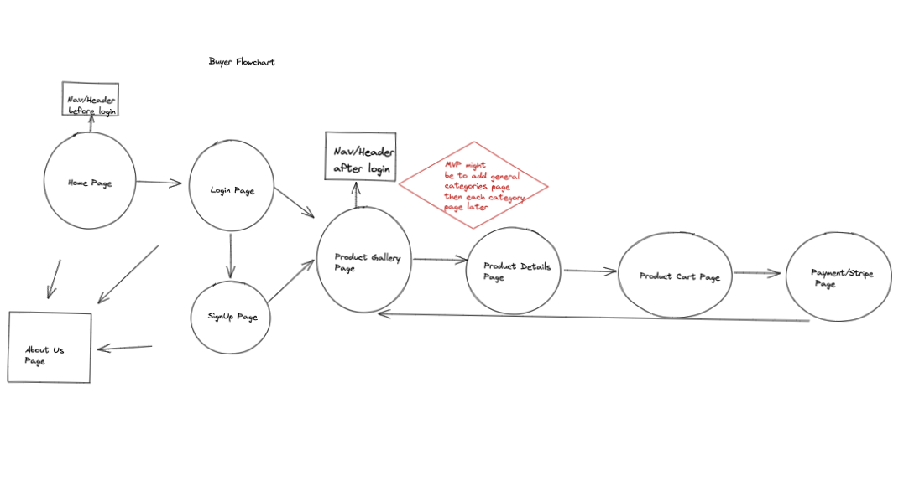

### Mockups

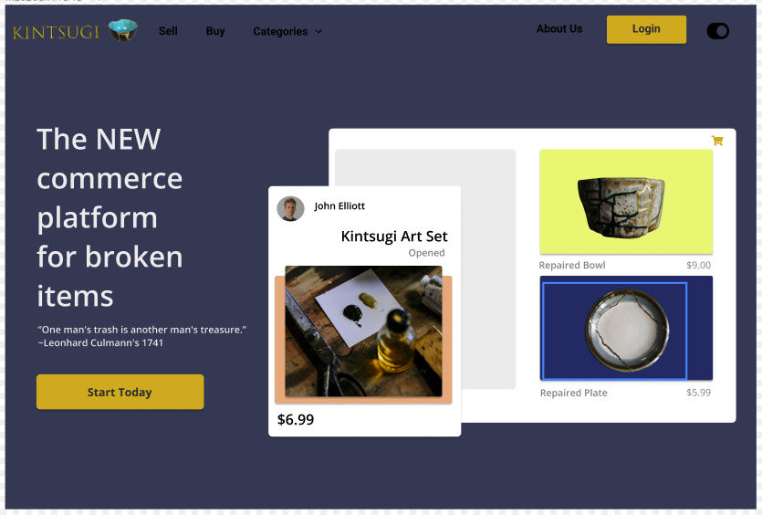

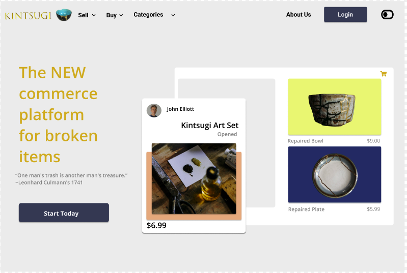


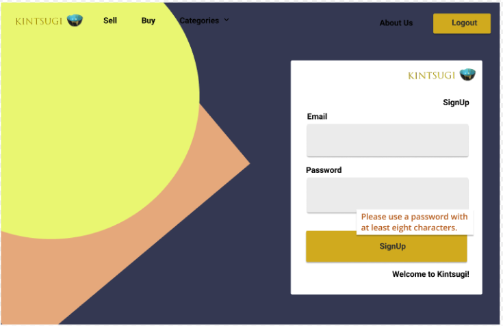

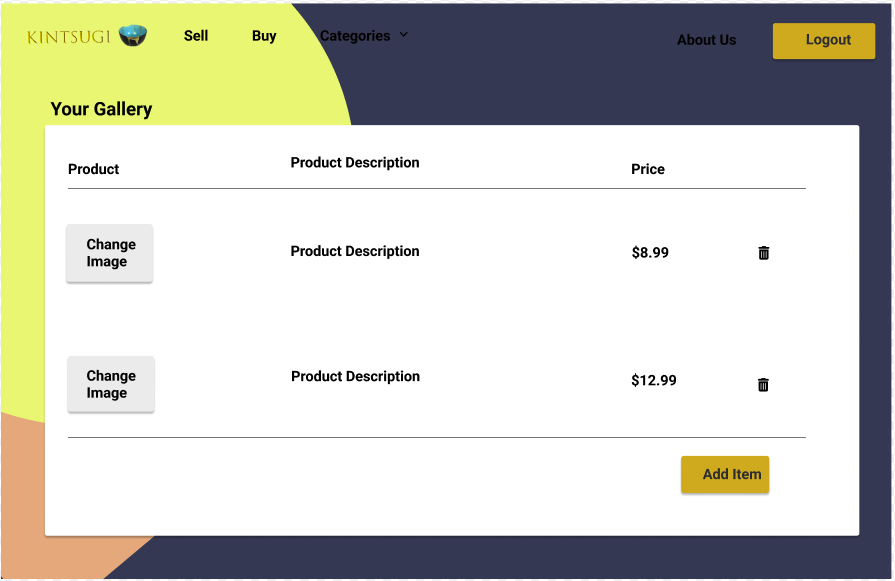

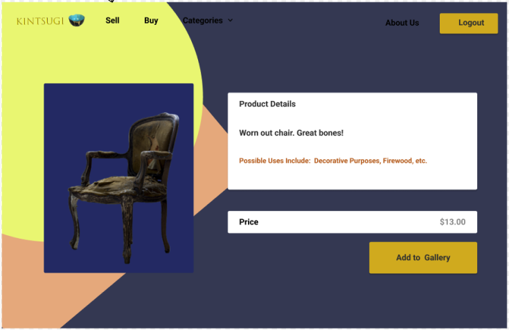

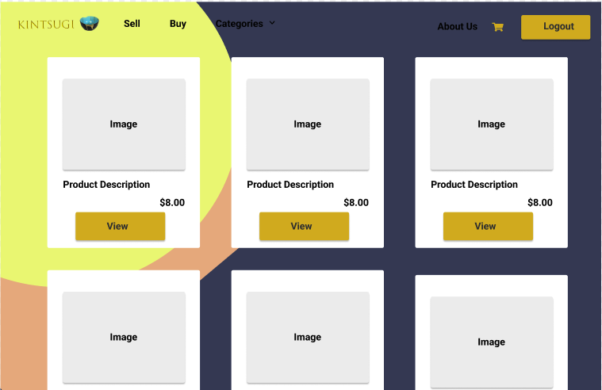

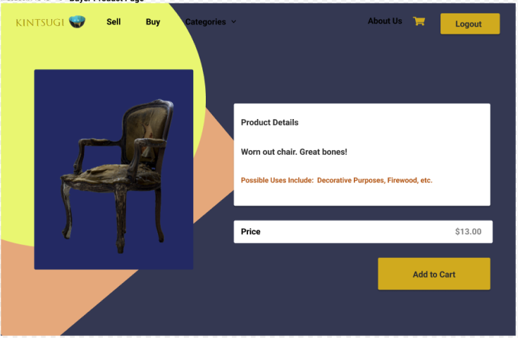

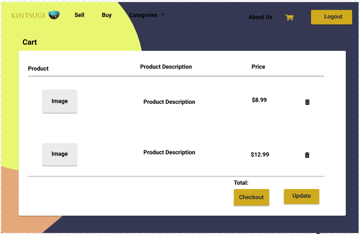


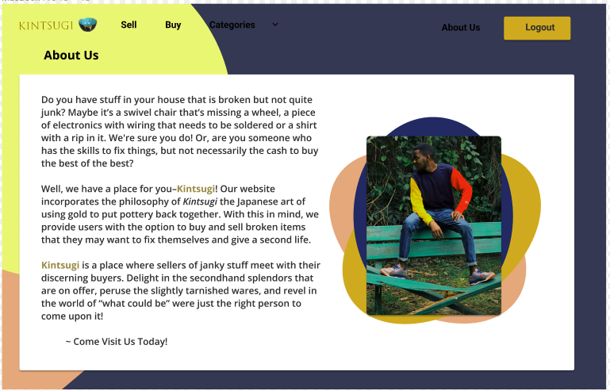

- https://styled-components.com/
- https://www.youtube.com/watch?v=-FZzPHSLauc&ab_channel=PedroTech
- https://www.figma.com/
- https://www.designify.com/
- https://coding-boot-camp.github.io/full-stack/github/professional-readme-guide
- https://unsplash.com/

## License

[](https://opensource.org/licenses/MIT)<br/>

    MIT License

    Copyright (c) 2022 COLLEEN FIMISTER, JOHN GALLAGHER, JACK MCNARY, ZACHARY ELLIOTT, MATT THURBER, ZAYMON GONZALEZ

    Permission is hereby granted, free of charge, to any person obtaining a copy
    of this software and associated documentation files (the "Software"), to deal
    in the Software without restriction, including without limitation the rights
    to use, copy, modify, merge, publish, distribute, sublicense, and/or sell
    copies of the Software, and to permit persons to whom the Software is
    furnished to do so, subject to the following conditions:

    The above copyright notice and this permission notice shall be included in all
    copies or substantial portions of the Software.

    THE SOFTWARE IS PROVIDED "AS IS", WITHOUT WARRANTY OF ANY KIND, EXPRESS OR
    IMPLIED, INCLUDING BUT NOT LIMITED TO THE WARRANTIES OF MERCHANTABILITY,
    FITNESS FOR A PARTICULAR PURPOSE AND NONINFRINGEMENT. IN NO EVENT SHALL THE
    AUTHORS OR COPYRIGHT HOLDERS BE LIABLE FOR ANY CLAIM, DAMAGES OR OTHER
    LIABILITY, WHETHER IN AN ACTION OF CONTRACT, TORT OR OTHERWISE, ARISING FROM,
    OUT OF OR IN CONNECTION WITH THE SOFTWARE OR THE USE OR OTHER DEALINGS IN THE
    SOFTWARE.

## Contributing

No contributions needed at this time, but please feel free to contact us at the email address below if you would like to contact us about this project.

## Links

[Live Link](https://kintsugi-johnslist.herokuapp.com/)

[GitHub Link](https://github.com/carlincb/johnslist)

## Questions

If you have questions, please contact us at carlin.colleen@gmail.com or find me at https://github.com/carlincb.
