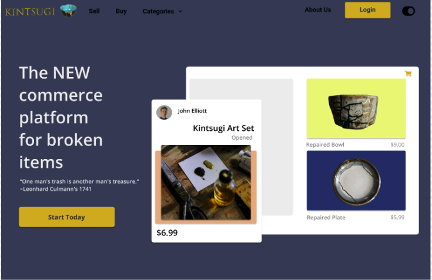
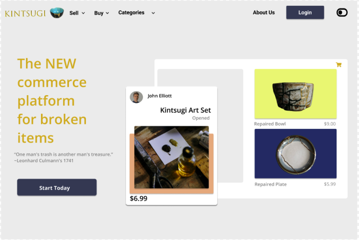
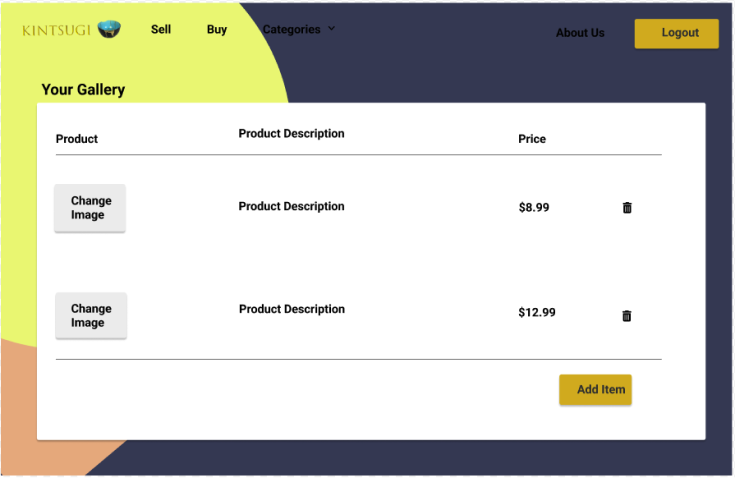
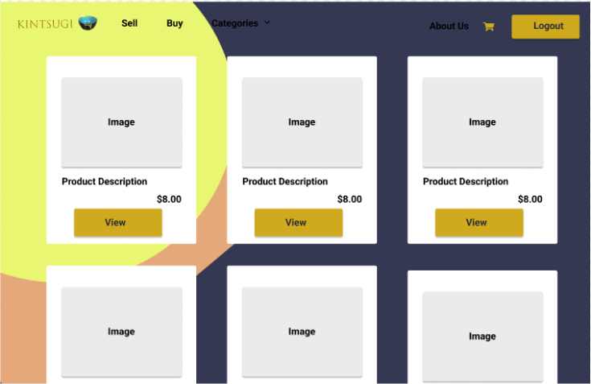
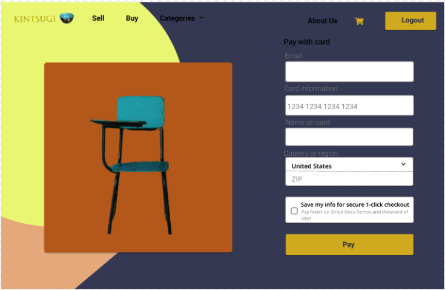

# Kintsugi

## Description

Do you have stuff in your house that is broken but not quite junk? Maybe it’s a swivel chair that’s missing a wheel, a piece of electronics with wiring that needs to be soldered or a shirt with a rip in it. We're sure you do! Or, are you someone who has the skills to fix things, but not necessarily the cash to buy the best of the best?

Well, we have a place for you–Kintsugi! Our website incorporates the philosophy of Kintsugi the Japanese art of using gold to put pottery back together. With this in mind, we provide users with the option to buy and sell broken items that they may want to fix themselves and give a second life.

Kintsugi is a place where sellers of janky stuff meet with their discerning buyers. Delight in the secondhand splendors that are on offer, peruse the slightly tarnished wares, and revel in the world of “what could be” were just the right person to come upon it!

    									~ Come Visit Us Today!

**Tools & Skills Used**<br>
React, Webpack, Heroku, MongoDB, React Router DOM, HTML, CSS, and Bootstrap.

- [Installation](#installation)
- [Usage](#usage)
- [Credits](#credits)
- [License](#license)
- [Contributing](#contributing)
- [Links](#links)
- [Questions](#questions)

## User Story

```md
AS A user trying to sell or buy slightly broken items
I WANT an ecommerce platform
SO THAT I can buy and sell broken items
```

## Acceptance Criteria

```md
GIVEN an ecommerce platform
WHEN I load the homepage
THEN I am presented with a page containing a header, a section for content
WHEN I view the header
THEN ...
```

## Installation

This is a webpage, so no installation is necessary.

## Usage

Please see below for examples of this application's usage:

### Workflow


### Mockups















- https://www.figma.com/
- https://www.designify.com/
- https://coding-boot-camp.github.io/full-stack/github/professional-readme-guide

## License

[](https://opensource.org/licenses/MIT)<br/>

    MIT License

    Copyright (c) 2022 COLLEEN FIMISTER

    Permission is hereby granted, free of charge, to any person obtaining a copy
    of this software and associated documentation files (the "Software"), to deal
    in the Software without restriction, including without limitation the rights
    to use, copy, modify, merge, publish, distribute, sublicense, and/or sell
    copies of the Software, and to permit persons to whom the Software is
    furnished to do so, subject to the following conditions:

    The above copyright notice and this permission notice shall be included in all
    copies or substantial portions of the Software.

    THE SOFTWARE IS PROVIDED "AS IS", WITHOUT WARRANTY OF ANY KIND, EXPRESS OR
    IMPLIED, INCLUDING BUT NOT LIMITED TO THE WARRANTIES OF MERCHANTABILITY,
    FITNESS FOR A PARTICULAR PURPOSE AND NONINFRINGEMENT. IN NO EVENT SHALL THE
    AUTHORS OR COPYRIGHT HOLDERS BE LIABLE FOR ANY CLAIM, DAMAGES OR OTHER
    LIABILITY, WHETHER IN AN ACTION OF CONTRACT, TORT OR OTHERWISE, ARISING FROM,
    OUT OF OR IN CONNECTION WITH THE SOFTWARE OR THE USE OR OTHER DEALINGS IN THE
    SOFTWARE.

## Contributing

No contributions needed at this time, but please feel free to contact me at my email address below if you would like to contact me about this project.

## Links

[Live Link](https://kintsugi-johnslist.herokuapp.com/)

[GitHub Link](https://github.com/carlincb/johnslist)

## Questions

If you have questions, please contact us at carlin.colleen@gmail.com or find me at https://github.com/carlincb.
